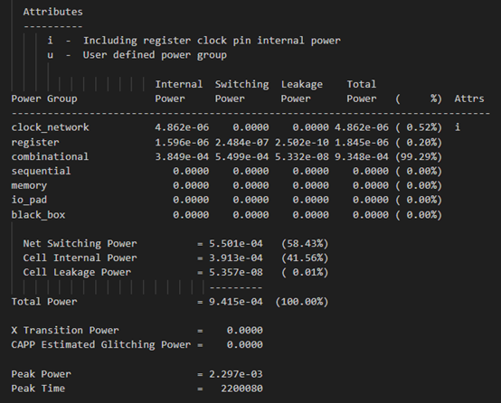
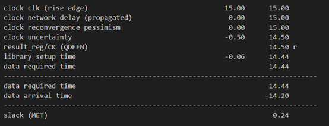
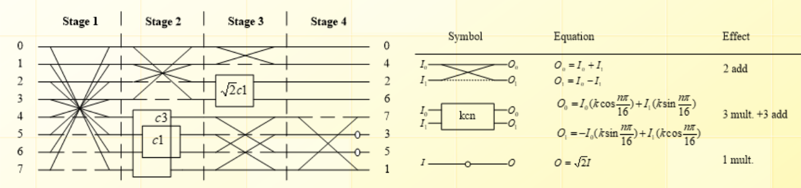
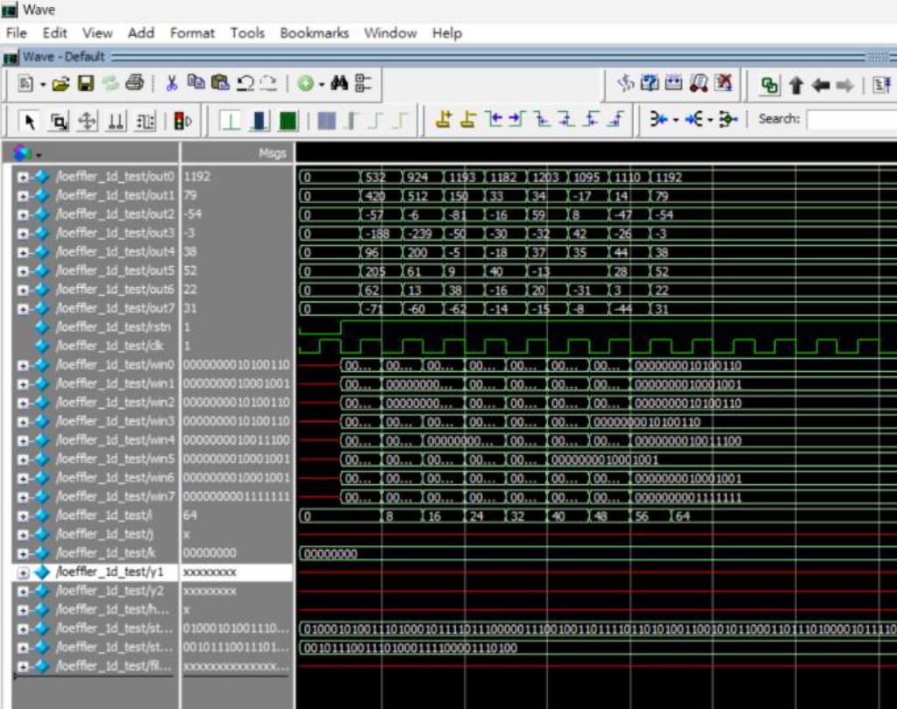
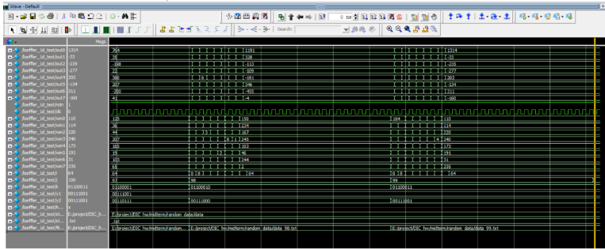
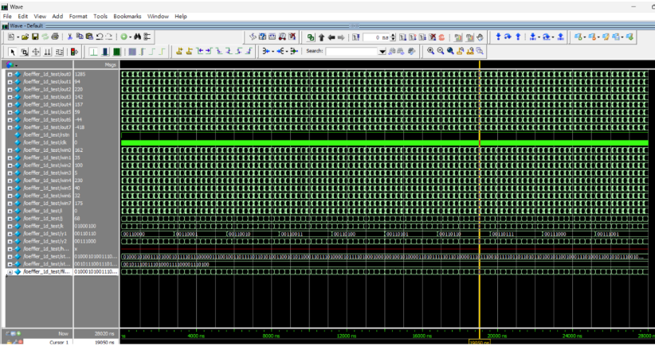
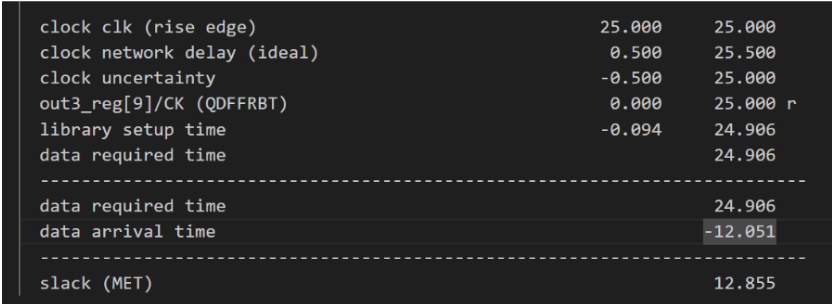
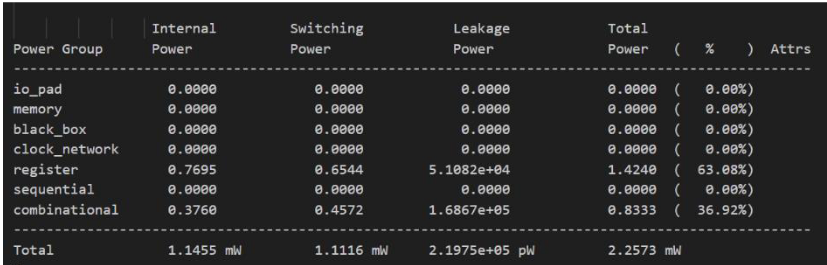
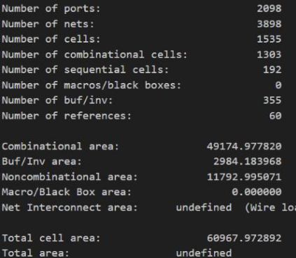

# Homeworks in DIC in 112-2

## Sobel (for edge detection)

### introduction

    Sobel 濾波器是一種常用的圖像處理技術，用於邊緣檢測。它是一種基於卷積的方法，用於在圖像中識別出邊緣和輪廓。Sobel 濾波器通過在圖像上應用一組特定的卷積核（也稱為模板或濾波器），在像素周圍計算梯度來實現這一目的。

    Sobel 濾波器通常是一個 3x3 的矩陣，分別計算水平和垂直方向的梯度。水平方向上的Sobel 濾波器可以檢測圖像中的垂直邊緣，而垂直方向上的 Sobel 濾波器可以檢測圖像中的水平邊緣。這些梯度值可以用於確定圖像中的邊緣位置和方向。在圖像處理中，Sobel 濾波器通常用於預處理步驟，以便在圖像中準確地檢測出邊緣，並在諸如邊緣檢測、特徵提取和圖像分割等任務中發揮重要作用。

### verilog implement

In0~In7: 將target
pixel周圍3*3陣列的數值存進暫存器
Th: Threshold，用來判斷哪些pixels為edges
Result: 將結果顯示，1為FF，0為00(hex)
Temp_x0 to temp_x3 : 計算陣列，並將結果給進Gx
Temp_y0 to temp_y2 : 計算陣列，並將結果給進Gy
最終將Gx及Gy丟進g，一但g值大於th_sqare，result=1；反之，result=0

而 Testbench將In0~In7讀進kernel module，利用for迴圈讀512*512的hex文字檔的每一個pixel，最終將結果丟進新的hex文字檔，完成設計。

[Verilog_code](sobel/kernel_alu.v)

### presim


### synthesis & primetime

|  |  |
| ----------------------------- | ----------------------------- |

### result

|  |      |
| ------------------------------ | ----------------------------- |
| [hex_file](sobel/lena_gray.txt)   | [hex_file](sobel/sobel_out1.txt) |

## DCT (Discrete Cosine Trasform)

### introduction

1. design a 1D Loeffler DCT
2. synthesis with umc 0.18um library and make at least 100 data tests (example only has 1 data test) get VCD for primetime measurement

in C code:

```c
double vp0, vp1, vp2, vp3, vn0, vn1, vn2, vn3;
vp0 = v[0] + v[7];
vp1 = v[1] + v[6];
vp2 = v[2] + v[5];
vp3 = v[3] + v[4];
vn0 = v[0] - v[7];
vn1 = v[1] - v[6];
vn2 = v[2] - v[5];
vn3 = v[3] - v[4];

if (j == 0) {
    return (vp0 + vp1 + vp2 + vp3);
}
else if (j == 4) {
    return (vp0 - vp1 - vp2 + vp3);
}
else if (j == 2) {
    return (vp1 - vp2) * a + (vp0 - vp3) * b;
}
else if (j == 6) {
    return (vp2 - vp1) * b + (vp0 - vp3) * a;
}
else if (j == 7) {
    return (((( - vn3) * d + vn0 * c) + (vn2 * e + vn1 * f)) - ((vn3 * c + vn0 * d) + (( - vn2) * f + vn1 * e)));
}
else if (j == 3) {
    return (PTt * (( - vn3) * d + vn0 * c) - (vn2 * e + vn1 * f));
}
else if (j == 5) {
    return (PTt * (vn3 * c + vn0 * d) - (( - vn2) * f + vn1 * e));
}
else if (j == 1) {
    return (((( - vn3) * d + vn0 * c) + (vn2 * e + vn1 * f)) + ((vn3 * c + vn0 * d) + (( - vn2) * f + vn1 * e)));
}

```

### verilog implement


在 verilog 中使用有號數 (signed)，用右移去估算小數，比如說 ${\sqrt{2} \cdot sin6\pi \over 16} \approx1.30$
而1.307 × 64 ≈ 83.6，使用乘 84 然後右移 6bit 來近似小數。並在 reset negative edge 時將 output 寫成 0。

### presim





### synthesis & primetime





