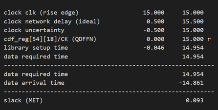

# Final project of DIC in 112-2

| Before                      | After                           |
| --------------------------- | ------------------------------- |
|  |    |
| [hexfile](./chickens.txt)      | [hexfile](./covert/chickens_o.txt) |

## introduction
    This is my final project done in end of the spring semester 2024. The project is to implement the Histogram Equalization algorithm in Verilog and design in IC design-compiler(modelsim, synthesis, and then primepower report).

## Histogram equalization
    Histogram equalization is an image processing technique used to enhance image contrast. Its primary purpose is to adjust the distribution of grayscale levels in an image, making them more uniform, thereby enhancing the overall contrast and detail of the image.

### Procedure

1. **Compute the Histogram**:

   - First, calculate the grayscale histogram of the input image, which represents the frequency of each grayscale value (0-255) appearing in the image.
2. **Compute the Cumulative Distribution Function (CDF)**:

   - The cumulative distribution function is the accumulated form of the grayscale histogram, used to determine the cumulative probability of each grayscale value in the image.
3. **Apply the Transformation Function**:

   - Use the cumulative distribution function to map the original grayscale values to new values. The transformation function is typically linear, meaning each grayscale value is linearly stretched to achieve a more uniform distribution of grayscale values.
4. **Generate the Output Image**:

   - Based on the transformation function, convert each pixel's grayscale value in the original image to the new value, thus producing a contrast-enhanced image.

## Implement

[Verilog file : HE.v](HE.v)
[TestBench Verilog file : HE_tb.v](HE_tb.v)

### state design

1. idle
   Num_BINS : 圖片的總pixels
   首先透過counter計數，將histogram、cdf、transformation_table都先設為0。每經過一次計算，counter就會+1，直到counter等於NUM_BINS，就會進入到下一階段(Cal_Hist)，並將counter歸零。
2. calc_hist
   藉由統計該pixel_value的出現次數，得到原圖的histogram分布。
   同前面，每經過一次計算，pixel_count就會+1，直到pixel_count等於NUM_BINS，就會進入到下一階段(CALC_CDF)。
3. calc_cdf
   計算CDF
4. apply_transform
   計算Transformation_table []
5. finish_send
   將原圖的pixels，經過Transformation_table轉換成新的pixels

### ref ppt

### testbench

1. original picture store in mem0
2. When done signal is high, copy transformed_pixel in TSM
3. Use the TSM to reorganize the picture, and then output the picture to hex file

## IC design compiler result

| time       |        |
| ---------- | ----------------------------------------- |
| area       |        |
| power      |       |
| prime_time |  |

<!--  -->
